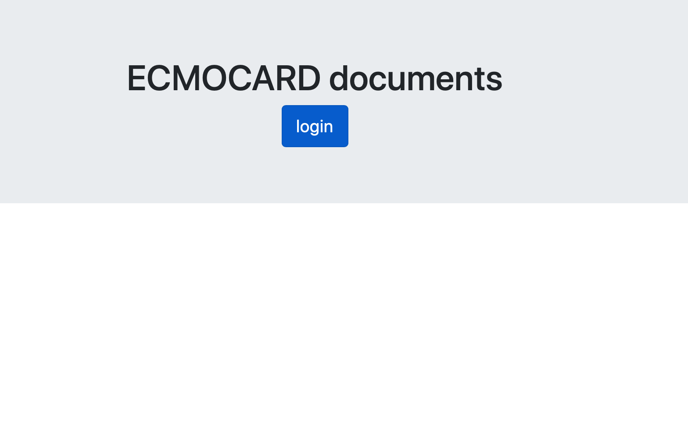

# Demo Sample upload to Amazon S3 
This app using Cognitio user pool and hosted ui to upload to s3 using IAM roles.



## Prerequisites
1. Set up Cognito user pools with hosted UI
2. Set up congnito identity pool using the user pool
3. Set up IAM role for the identity pool to have access to s3
4. Set up CORS for the s3 bucket to upload to

    ```xml
    <?xml version="1.0" encoding="UTF-8"?>
    <CORSConfiguration xmlns="http://s3.amazonaws.com/doc/2006-03-01/">
    <CORSRule>
        <AllowedOrigin>https://youcloudfront.cloudfront.net</AllowedOrigin>
        <AllowedMethod>POST</AllowedMethod>
        <AllowedMethod>GET</AllowedMethod>
        <AllowedMethod>PUT</AllowedMethod>
        <AllowedMethod>DELETE</AllowedMethod>
        <AllowedMethod>HEAD</AllowedMethod>
        <AllowedHeader>*</AllowedHeader>
        <ExposeHeader>ETag</ExposeHeader>
    </CORSRule>
    </CORSConfiguration>
    ```


## Configure

1. The configuration is in [app.js](src/app.js)
2. The login hosted UI url is in [src/index.html](src/index.html)

## Useful resources

1. https://aws.amazon.com/blogs/developer/authentication-with-amazon-cognito-in-the-browser/ Authentication with Amazon Cognito in the Browser

2. https://docs.aws.amazon.com/sdk-for-javascript/v2/developer-guide/s3-example-photo-album.html   Uploading Photos to Amazon S3 from a Browser


